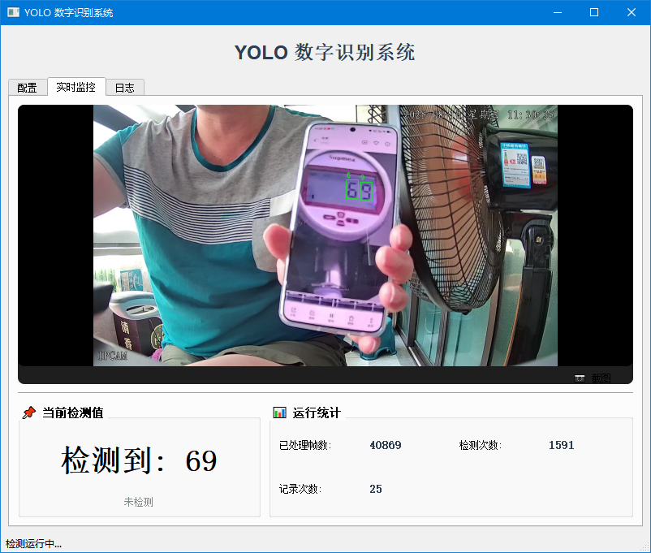
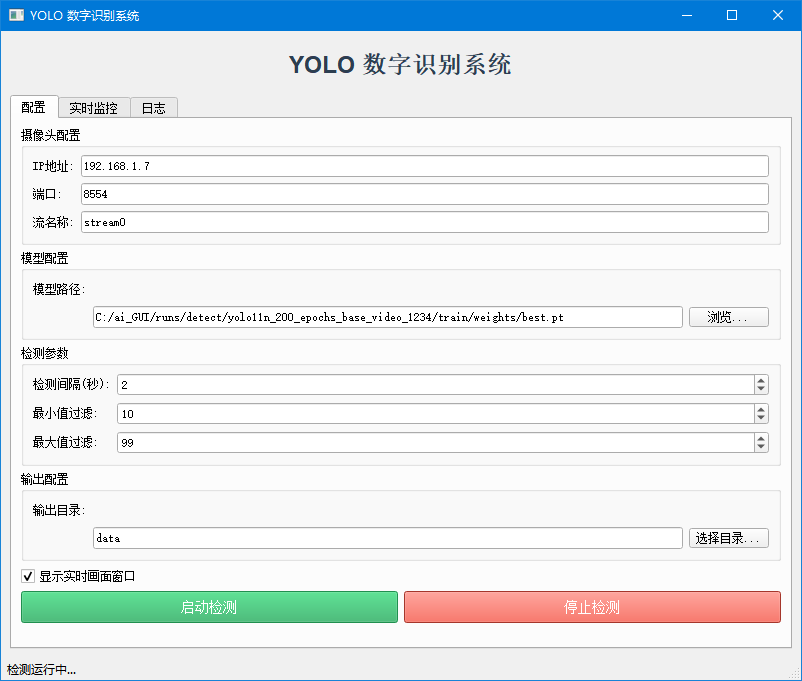
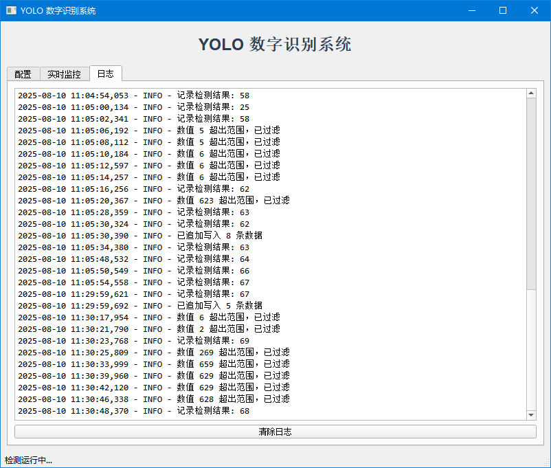

# YOLO 远程数字识别系统

基于 [Ultralytics YOLO11](https://github.com/ultralytics/ultralytics) 的实时数字识别系统，通过 RTSP 网络摄像头抓取视频流，自动检测画面中的数字并记录到 Excel 文件。提供**命令行**和**图形界面**两种运行模式。

## 📸 界面截图

### 配置页面



### 实时监控页面



### 日志页面



## ✨ 主要功能

- **RTSP 视频流接入**：支持任意 RTSP 网络摄像头，30 秒超时自动重连
- **YOLO 数字检测**：实时检测画面中的 0-9 数字，按空间位置从左到右排列
- **智能记录策略**：
  - 数值变化时立即记录
  - 相同数值超过 60 秒后再次记录（避免重复）
  - 支持 min/max 值范围过滤（如只记录 10-99 的两位数）
- **可调检测间隔**：逐帧检测或按秒级间隔检测，平衡性能与实时性
- **双模式运行**：命令行模式（适合服务器/嵌入式部署）和 PyQt5 图形界面（适合桌面使用）
- **数据导出**：自动生成带时间戳的 Excel 文件，包含帧号、时间、检测数值三列
- **日志记录**：文本日志同步写入，便于事后追溯

## 🏗️ 项目结构

```
yolo-remote-digit-recognition/
├── command_line_mode/               # 命令行版本
│   ├── test_net_cam_v1.py          # 主程序
│   ├── data/                        # Excel 输出目录
│   └── log/                         # 日志目录
├── gui_mode/                        # GUI 版本（PyQt5）
│   ├── core_logic.py               # 核心逻辑层
│   ├── gui_main.py                 # GUI 主窗口
│   ├── config.ini                  # 配置文件（持久化用户设置）
│   ├── start.bat                   # Windows 启动脚本
│   ├── runs/detect/                # 模型训练结果
│   │   ├── yolo11n_200_epochs/     # YOLO11 nano 训练结果
│   │   └── yolo11s_200_epochs/     # YOLO11 small 训练结果
│   ├── data/                        # Excel 输出
│   └── log/                         # 日志输出
├── doc/                             # 文档
│   └── 数据集标注及YOLO11模型训练.docx
├── img/                             # 截图
│   ├── 1.png
│   ├── 2.png
│   └── 3.png
├── LICENSE
└── README.md
```

## 🔄 架构设计

```
RTSP摄像头 ──> StreamReceiver(线程1) ──> Queue(maxsize=2) ──> YOLOProcessor(线程2) ──> Excel + 日志
```

- **StreamReceiver**：负责 RTSP 流连接、断线重连、取帧入队。采用线程安全的有界队列，自动丢弃旧帧防止内存堆积。
- **YOLOProcessor**：从队列取帧 → 按间隔执行 YOLO 推理 → 数字排列 → 值范围过滤 → 变化检测 → 定期批量写 Excel。

两个版本共享相同的核心流程，GUI 版将核心逻辑抽取为可复用的类（`core_logic.py`），便于维护和扩展。

## 🚀 快速开始

### 环境要求

- Python 3.8+
- 网络摄像头（支持 RTSP 协议）

### 安装依赖

```bash
pip install ultralytics opencv-python pandas openpyxl
# GUI 模式额外依赖
pip install PyQt5
```

### 命令行模式

```bash
cd command_line_mode
python test_net_cam_v1.py --ip 192.168.31.1 --interval 2 --min 10 --max 999 --display
```

| 参数 | 说明 | 默认值 |
|------|------|--------|
| `--ip` | 摄像头 IP 地址 | `192.168.31.1` |
| `--interval` | 检测间隔（秒），0 表示每帧检测 | `2` |
| `--min` | 只记录大于等于该值的数字 | 无下限 |
| `--max` | 只记录小于等于该值的数字 | 无上限 |
| `--display` | 显示检测图像窗口 | 开启 |
| `--no-display` | 不显示图像窗口 | — |

按 `Ctrl+C` 或在图像窗口按 `q` 键安全退出。

### GUI 模式

**Windows：** 双击 `gui_mode/start.bat`

**Linux/Mac：**
```bash
cd gui_mode
python gui_main.py
```

在图形界面中可配置摄像头参数、模型路径、检测参数等，设置会自动保存到 `config.ini`。

## 📊 数据集与模型训练

本项目使用 YOLO11 nano 和 YOLO11 small 两个模型，均基于自定义数字数据集训练 200 个 epoch。

### 数据集准备

1. 使用 [labelImg](https://github.com/HumanSignal/labelImg.git) 标注图片中的数字（0-9）
2. 数据集目录结构：

```
data/
├── images/
│   ├── train/
│   └── val/
├── labels/
│   ├── train/
│   ├── val/
│   └── classes.txt
└── data.yaml
```

### 训练模型

```python
from ultralytics import YOLO

model = YOLO("yolo11n.pt")  # 或 yolo11s.pt
model.train(data="data.yaml", epochs=200, imgsz=640)
```

详细步骤参见 `doc/数据集标注及YOLO11模型训练.docx`。

## 📄 许可证

本项目基于 MIT License 开源。详见 [LICENSE](LICENSE) 文件。

Copyright (c) 2026 Haoyu Liu
